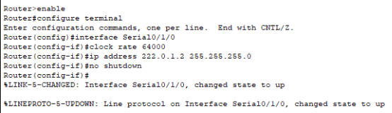
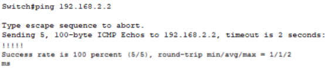

# **模拟企业网络全栈仿真报告**

一、实验目的及要求

完成简单企业网的设计并实施以下实验

1) **静态路由的部署与实施**
1) **OSPF动态路由的部署和实施**
1) **RIP的规划与配置**
1) **VLAN的规划与配置**
1) **配置交换机Trunk和Access模式**
1) **配置服务器FTP及WIFI**
1) **路由策略与动态NAT的配置**
1) **静态路由失效对网络的影响**
1) **路由失效对ospf协议的影响**
1) **路由失效对rip协议的影响**

二、实验实习设备（环境）及要求（软硬件条件）

Cisco Packet Tracer

三、实验实习项目、内容与步骤

**AA企业园区网络设计工程实施方案**

1. **项目概述** 

   **1.1 项目名称**：AA企业园区网络设计项目

   **1.2 项目背景**：针对当前企业业务扩展和网络安全需求，需升级现有网络以支持更高的数据处理能力和更强的安全防护。

   **1.3 项目目标**：建设一个高性能、高可靠性、易管理和具备良好扩展性的企业网络，确保数据安全，提升工作效率。  

   **1.4 项目范围**：涵盖网络架构设计、设备选型、系统配置、布线方案、安全策略、施工安装、培训与维护。

1. **网络规划** 

   **2.1 网络拓扑结构设计**：采用分层架构，包括核心层、汇聚层、接入层。核心层负责高速数据传输，汇聚层实现网络策略，接入层连接终端用户。
   
   图 1 网络拓扑图

   **2.2.1具体网络设计步骤及实验结果**

1) **静态路由的部署与实施**

按照对应命令规划和配置网络中各网络设备端口的IP地址

最终均已亮起绿灯表示联通

1  浮动静态路由实验：Router0为某公司总部，Router1、Router3是两个分部，主机PC0、PC1所在的网段分别模拟两个分部中的办公网络

   
   将三个路由器按照相关命令配置

   
   均联通

   
   查看路由器0的路由表

   
   路由器1的路由表

   
   路由器2的路由表

   
   当PC0向PC1发送数据包时，这时数据包会直接从Router1发往Router2而不经过router0，接下来查看PC0向PC1发送数据包的路径

   
1  负载均衡：按照实验重新配置后，查看各路由表

路由器0:

路由器1：

路由器2：

两条路径是等优的

1) **OSPF动态路由的部署和实施**

公司总部OSPF区域网络拓扑

执行命令过程中始终出现not enabled,经查阅资料后发现是没有开启routing功能，只要执行ip routing就可以了

再按照步骤依次配置

查看R1路由表

查看R1的ospf邻居

用Switch0去ping Router2的S0/2/0接口,实现了互通

1) **RIP的规划与配置**

对每个路由器依次输入命令

配置完成查看路由表

1) **VLAN的规划与配置**

在研发部配置vlan10,在生产部配置vlan20,查看vlan后确认配置成功

1) **配置交换机Trunk和Access模式**

输入命令并检查是否成功

配置研发部和生产部中二层交换机的access

1) **配置服务器FTP及WIFI**

加入用户名和密码然后输入命令

配置成功

配置WIFI

WIFI连接成功

1) **路由策略与动态NAT的配置**

对路由器依次进行配置

由PC2访问外网服务器成功

PC1也ping通

查看R0的NAT转化记录

1) **静态路由失效对网络的影响**

手动关闭Router1的S0/0/0接口模拟Router1与Router2之间的链路故障再查看PC0是否可以ping通PC1

再次查看路由器1的路由表，出现了管理距离为120的静态路由

1) **路由失效对ospf协议的影响**

现在使用主机2检查和R0的连通性，再使用tracert命令追踪查看路径

由此我们可以看出数据包经过的路径是Switch0-R2-R0

现在我们断开Router0—Router2的链路

查看Router0的ospf邻居

少了Router-id为4.4.4.4的邻居路由器，即Router2.

再在PC3上使用tracert 命令进行验证

传送数据失败

1) **路由失效对rip协议的影响**

查看路由器0的路由表

接下来，我们在R0上开启rip 的debug调试

我们会看到，R0上面的开启rip的端口上都会收到和发送ripv2的数据包，其中包含许多详细报文信息，可以读取到路由的网段、下一跳、跳数、接收接口等信息。

思路：断开Router0-Router1的链路来使网段失效，查看Router2的变化过程。

首先，我们查看一下R2的rip数据库

然后断开

马上查看R2的数据库

网段随即变为is possibly down的状态

` `**2.2 IP地址规划**：采用私有IP地址分配策略，按部门和业务功能划分子网，使用VLAN技术进行隔离。  

` `**2.3 网络传输介质选择**：主干网络使用单模光纤，确保远距离和高速度传输；局部网络使用Cat6双绞线。  

` `**2.4 网络安全策略设计**：实施网络隔离、入侵防御系统（IDS）、入侵预防系统（IPS）和统一威胁管理（UTM）等多层安全措施。  

` `**2.5 QoS策略设计**：为不同类型的业务流量（如视频会议、VOIP、数据备份）设置不同的优先级，保证关键业务的流畅。

1. **网络设备选型**

   ` `**3.1 核心交换机选型**：华为CloudEngine 12800系列，满足高性能、高可靠性需求。  

   ` `**3.2 接入层交换机选型**：华为CloudEngine 6800系列，支持丰富的接入功能。  

   ` `**3.3 路由器选型**：华为AR3200系列，提供稳定的路由功能和强大的安全性能。  

   ` `**3.4 无线AP选型**：华为AirEngine 8700系列，支持Wi-Fi 6，确保高密度场景下的无线覆盖。  

   ` `**3.5 服务器选型**：华为FusionServer Pro系列，高性能计算和存储解决方案。

   **网络布线方案**

   ` `**4.1 楼层布线**：使用综合布线系统，垂直走线采用光纤连接楼层间的汇聚点，水平布线使用Cat6线缆连接到工作区。  

   ` `**4.2 走廊布线**：在走廊天花板上方设置线槽，隐藏布线，维持办公环境美观。

   ` `**4.3 机柜布线**：机房内部署标准化机柜，使用有色标识的线缆进行管理，方便识别和维护。

   **5.1 施工计划**：详细规划施工阶段的时间表，包括前期准备、实际施工和验收测试等关键节点。

   **5.2 施工流程**：先进行主线布线，确保主干网络的连通性和稳定性，然后进行分支布线，最后进行终端接入和设备安装。

   **5.3 安装要求**：所有设备安装位置需考虑未来扩展的便利性，同时确保通风散热和电源供应的可靠性。固定方式需满足防震、防静电标准。

   **5.4 质量检查**：施工过程中，对布线、设备安装、系统配置进行多阶段检查，确保符合设计规范和安全标准。

   培训与维护 

   **6.1 培训计划**：为管理人员和终端用户提供网络管理、日常维护和故障排除的培训，确保他们能够有效管理和使用网络资源。

   **6.2 维护策略**：建立定期巡检和即时故障响应机制，制定详细的网络运维手册和故障处理流程。

   **6.3 备份与恢复**：实施定期的系统和数据备份计划，确保重要数据和配置的安全，制定紧急恢复策略以应对可能的系统故障。

   报价清单

   **7.1 设备费**： 核心交换机：￥30,000 x 1 = ￥30,000

   `   `- 接入层交换机：￥10,000 x 5 = ￥50,000

   `   `- 路由器：￥20,000 x 4 = ￥80,000

   `   `- 无线AP：￥5,000 x 1 = ￥5000

   `   `- 服务器（标准配置）：￥50,000 x 2 = ￥100,000

   `   `- 其他网络设备（UPS、防火墙等）：￥50,000

   `   `- 设备费小计：￥315,000

   **7.2 工程费**：   - 人工费（设计、安装、配置）：￥100,000

   `   `- 材料费（光纤、双绞线、接口等）：￥50,000

   `   `- 工程费小计：￥150,000

   **7.3 培训费**：   - 培训材料和设施：￥10,000

   `   `- 讲师费用：￥20,000

   `   `- 培训费小计：￥30,000

   **7.4 维护费**：维护费（首年）：140000

   `   `- 定期巡检和故障处理：￥50,000

   `   `- 系统升级和优化：￥20,000

   `   `- 维护费小计：￥70,000

   **7.5 其他费用**：- 差旅费：￥10,000

   `   `- 税费（假设10%）：￥71,000

   `   `- 其他费用小计：￥81,000

   总计：￥646,000

   四、实验实习结果分析和（或）源程序调试过程

   网络仿真设计的评价与优化可以看作是对一个虚拟网络系统的构建和管理过程的检验。我们需要评估这个系统的性能，就像检查互联网的速度和稳定性一样，关注数据的传输速度、延迟时间、丢包率和数据到达的一致性。同时，我们也要确保网络中的设备，如路由器和交换机，不会过载并保持正常运行。此外，评价路由器的智能程度也很重要，即它是否能快速地找到数据传输的最佳路径并在出现故障时迅速应对。对于交换机而言，我们要确认它能否有效地管理数据流向并避免网络拥堵。发现任何问题后，我们可以采取各种优化措施，比如调整数据传输的路线、实施负载均衡策略或升级硬件设备，来提升网络的整体性能。通过这样的学习和实践，我们不仅能够深入理解网络的工作原理，还能学会如何解决实际的网络问题。

